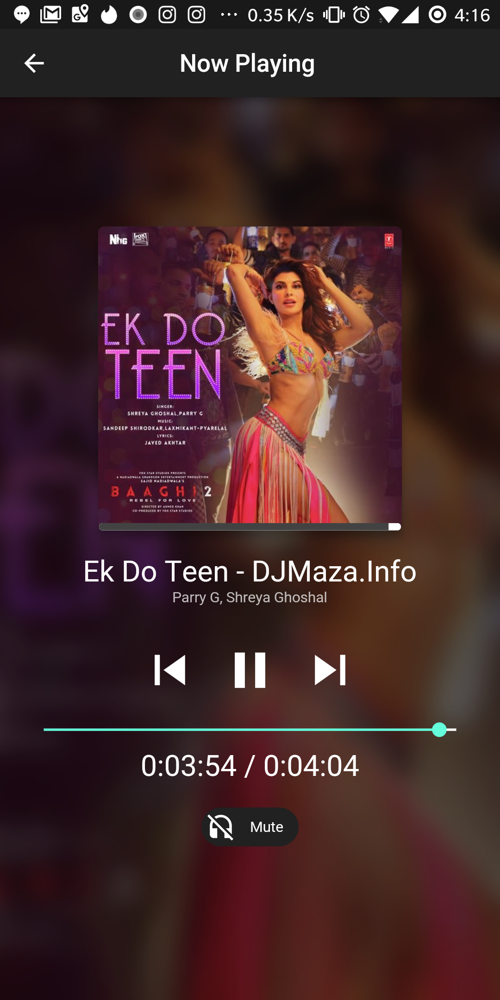
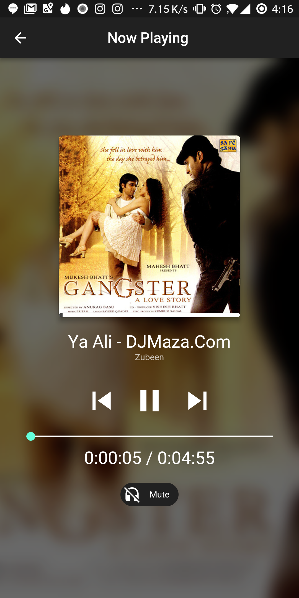
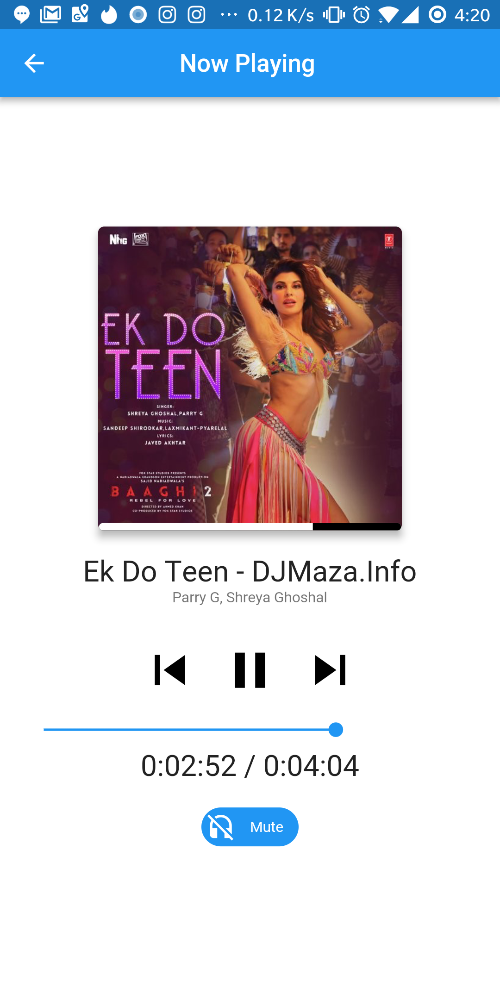

# Flute Music Player Plugin Only

First Open Source Flutter based material design music player with audio plugin to play local music files.(Online Radio will be added soon.)

## Features

* [x] Android (iOS Coming Soon)

  * [x] Fetch local songs (Inbuilt Permission)
  * [x] Beautiful UI with multiple themes(Coming Soon)
  * [x] Animation
  * [x] Full Fledged Example
  * [x] play (local files)
  * [x] stop
  * [x] pause
  * [x] seek
  * [x] shuffle
  * [x] Album Art
  * [x] onComplete
  * [x] onDuration / onCurrentPosition

* Supported formats

  * [Android](https://developer.android.com/guide/topics/media/media-formats.html)

### Show some :heart: and star the repo to support the project

* Please note this is a plugin only. Actual project's link is below

## Music Player Development Project

[Flute Music Player](https://github.com/iampawan/Flutter-Music-Player)

### Screenshots

    

## Usage

[Example](https://github.com/iampawan/Flute-Music-Player/blob/master/example/lib/main.dart)

To use this plugin :

* add the dependency to your [pubspec.yaml](https://github.com/iampawan/Flute-Music-Player/blob/master/example/pubspec.yaml) file.

```yaml
  dependencies:
    flutter:
      sdk: flutter
    flute_music_player:
```

* instantiate an Music Finder instance

```dart
//...
MusicFinder audioPlayer = new MusicFinder();
//...
```

# Fetch Songs

```dart
//...
var songs = MusicFinder.allSongs();
//...
```

### play, pause , stop, seek

```dart
play() async {
  final result = await audioPlayer.play(kUrl);
  if (result == 1) setState(() => playerState = PlayerState.playing);
}

// add a isLocal parameter to play a local file
playLocal() async {
  final result = await audioPlayer.play(kUrl);
  if (result == 1) setState(() => playerState = PlayerState.playing);
}


pause() async {
  final result = await audioPlayer.pause();
  if (result == 1) setState(() => playerState = PlayerState.paused);
}

stop() async {
  final result = await audioPlayer.stop();
  if (result == 1) setState(() => playerState = PlayerState.stopped);
}

// seek 5 seconds from the beginning
audioPlayer.seek(5.0);
```

### duration, position, complete, error (temporary api)

The Dart part of the plugin listen for platform calls :

```dart
//...
audioPlayer.setDurationHandler((Duration d) => setState(() {
  duration = d;
}));

audioPlayer.setPositionHandler((Duration  p) => setState(() {
  position = p;
}));

audioPlayer.setCompletionHandler(() {
  onComplete();
  setState(() {
    position = duration;
  });
});

audioPlayer.setErrorHandler((msg) {
  print('audioPlayer error : $msg');
  setState(() {
    playerState = PlayerState.stopped;
    duration = new Duration(seconds: 0);
    position = new Duration(seconds: 0);
  });
});
```

##Credit for audioplayer plugin
[Erick Ghaumez](https://github.com/rxlabz/audioplayer)
[Detailed Example for AudioPlayer](https://github.com/rxlabz/audioplayer/blob/master/example/lib/main.dart)

## iOS

### Alert: iOS implementation

This project is not implemented for ios yet.So wait for it or if you can contribute then please do help.

# Pull Requests

I welcome and encourage all pull requests. It usually will take me within 24-48 hours to respond to any issue or request. Here are some basic rules to follow to ensure timely addition of your request:

1.  Match coding style (braces, spacing, etc.) This is best achieved using `Reformat Code` feature of Android Studio `CMD`+`Option`+`L` on Mac and `CTRL` + `ALT` + `L` on Linux + Windows .
2.  If its a feature, bugfix, or anything please only change code to what you specify.
3.  Please keep PR titles easy to read and descriptive of changes, this will make them easier to merge :)
4.  Pull requests _must_ be made against `develop` branch. Any other branch (unless specified by the maintainers) will get rejected.
5.  Check for existing [issues](https://github.com/iampawan/Flute-Music-Player/issues) first, before filing an issue.
6.  Make sure you follow the set standard as all other projects in this repo do
7.  Have fun!

### Created & Maintained By

[Pawan Kumar](https://github.com/iampawan) ([@imthepk](https://www.twitter.com/imthepk)) ([Youtube](https://www.youtube.com/c/MTechViral))
([Insta](https://www.instagram.com/codepur_ka_superhero))

> If you found this project helpful or you learned something from the source code and want to thank me, consider buying me a cup of :coffee:
>
> * [PayPal](https://www.paypal.me/imthepk/)

# License

    Copyright 2018 Pawan Kumar

    Licensed under the Apache License, Version 2.0 (the "License");
    you may not use this file except in compliance with the License.
    You may obtain a copy of the License at

       http://www.apache.org/licenses/LICENSE-2.0

    Unless required by applicable law or agreed to in writing, software
    distributed under the License is distributed on an "AS IS" BASIS,
    WITHOUT WARRANTIES OR CONDITIONS OF ANY KIND, either express or implied.
    See the License for the specific language governing permissions and
    limitations under the License.

## Getting Started

For help getting started with Flutter, view our online
[documentation](http://flutter.io/).

For help on editing plugin code, view the [documentation](https://flutter.io/platform-plugins/#edit-code).
